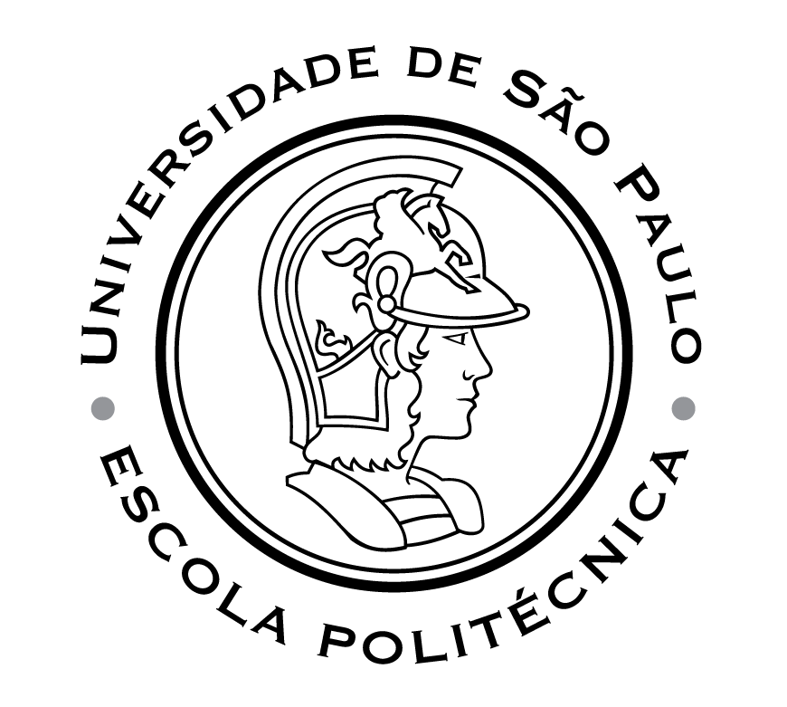

---
hide:
  - navigation
---

# **Humberto Sandmann**

{ style='border-radius: 10px;', align=left }

!!! custom inline end ""

    [:material-email-outline:](mailto:hsandmann@ieee.org){:target='_blank'} [hsandmann@ieee.org](mailto:hsandmann@ieee.org){:target='_blank'}

    [:material-link:](index.md) [hsandmann.github.io](index.md) 
    [:material-github:](https://github.com/hsandmann){:target='_blank'} [hsandmann](https://github.com/hsandmann){:target='_blank'} 
    [:material-linkedin:](https://www.linkedin.com/in/hsandmann/){:target='_blank'} [hsandmann](https://www.linkedin.com/in/hsandmann/){:target='_blank'} 
    [:simple-orcid:](https://orcid.org/0000-0001-7758-695X){:target='_blank'} [0000-0001-7758-695X](https://orcid.org/0000-0001-7758-695X){:target='_blank'} 
    <!-- [:simple-odysee:](https://odysee.com/@sandmann){:target='_blank'} [sandmann](https://odysee.com/@sandmann){:target='_blank'} -->

Computer scientist specializing in bio-inspired neural computing, computational complexity and dynamics, pattern recognition, small-world theory, and banking knowledge. With a focus on understanding the foundations of human computation, I investigate biological neuronal approaches to replicate processing behaviors in computational intelligence.

In the realm of programming, I bring a strong background in highly complex domains, including modeling, software architecture, artificial intelligence, machine learning, deep learning, computer vision, cryptography, and high-performance computing, among others.

## Research Interests

Computational for large-scale systems 
Machine learning and artificial neural networks 
Nonlinear systems and dynamics networks 
Synchronization of coupled oscillators

## Background

<table>
    <tr>
        <td align='center'>
            <a href='./assets/doc/usp-doutorado-diploma.pdf' target='_blank'>mar.2012</a> 
            <a href='./assets/doc/usp-doutorado-grade.pdf' target='_blank'>&#8593;</a> 
            mar.2007
        </td>
        <td>
            D.Sc.<a href='http://ppgee.poli.usp.br/' target='_blank'>Polytechnic School of the University of Sao Paulo</a> 
            thesis<a href='https://doi.org/10.11606/T.3.2012.tde-05092012-165022' target='_blank'>Spike patterns and computation in dynamical neural networks</a> 
            

            doi<a href='https://doi.org/10.11606/T.3.2012.tde-05092012-165022' target='_blank'>10.11606/T.3.2012.tde-05092012-165022</a> 
            advisor<a href='https://www.lsi.usp.br/~emilio/index.htm' target='_blank'>Prof. Dr. Emilio Del Moral Hernandez</a> 
            presentation<a href='https://docs.google.com/presentation/d/e/2PACX-1vRz_rBkIJvEPpmL-LFe5bpTcQPEJ7uV1MKlU6L8_seherHmeSdKJ62v9IImdRrqPjX3El32ypNaFToz/pub?start=false&loop=false&delayms=3000' target='_blank'>slides</a> 
            supported by
            <ul class='support-list'>
                <li class='support-item'>
                    <a href='http://www.cnpq.br/' target='_blank'>CNPq</a> - grant 140632/2007-7 
                    <small>mar.2007 → dec.2009 ∧ sep.2010 → feb.2011</small>
                </li>
            </ul>
        </td>
        <td></td>
    </tr>
    <tr>
        <td align='center'>
            <a href='./assets/doc/mpi-report-marc_timme.pdf' target='_blank'>sep.2010</a> 
            &#8593; 
            <a href='./assets/doc/mpi-acceptance.pdf' target='_blank'>aug.2009</a>
        </td>
        <td>
            D.Sc. Internship<a href='https://www.ds.mpg.de/' target='_blank'>Max Planck Gesellschaft für Dynamik und Selbstorganisation</a> 
            advisor<a href='https://www.ds.mpg.de/person/20494/3509782' target='_blank'>Prof. Dr. Marc Timme</a> 
            supported by
            <ul class='support-list'>
                <li class='support-item'>
                    <a href='http://www.capes.gov.br/' target='_blank'>CAPES</a> - grant <a href='./assets/doc/capes-bex_4076-09-5.pdf' target='_blank'>BEX 4076-09-5</a> 
                    <small>jan.2010 → ago.2010</small>
                </li>
                <li class='support-item'>
                    <a href='http://www.usp.br/prpg/' target='_blank'>Pró-Reitoria da Pós-Graduação da USP</a> 
                    <small>aug.2009 ∧ dec.2009 (flight tickets GRU ⇄ FRA)</small>
                </li>
                <li class='support-item'>
                    José Humberto Sandmann - my father 
                    <small>aug.2009 → dec.2009 (German language classes/exams)</small>
                </li>
                <li class='support-item'>
                    <a href='http://www.mpg.de/' target='_blank'>Max Planck Institute - Networks Dynamics Group</a> 
                    <small>aug.2009 → nov.2009 (accommodation in Goettingen)</small>
                </li>
            </ul>
        </td>
        <td></td>
    </tr>
    <tr>
        <td align='center'>
            <a href='./assets/doc/usp-mestrado-diploma.pdf' target='_blank'>jun.2006</a> 
            <a href='./assets/doc/usp-mestrado-grade.pdf' target='_blank'>&#8593;</a> 
            feb.2003
        </td>
        <td>
            M.Sc.<a href='http://ppgee.poli.usp.br/' target='_blank'>Polytechnic School of the University of Sao Paulo</a> 
            dissertation<a href='https://doi.org/10.11606/D.3.2006.tde-01042009-095125' target='_blank'>Prediction of time series using architecture based on neuro-fuzzy systems</a> 
            

            doi<a href='https://doi.org/10.11606/D.3.2006.tde-01042009-095125' target='_blank'>10.11606/D.3.2006.tde-01042009-095125</a> 
            advisor<a href='https://www2.pcs.usp.br/~mtulio/' target='_blank'>Prof. Dr. Marco Túlio Carvalho de Andrade</a> 
        </td>
        <td></td>
    </tr>
    <tr>
        <td align='center'>
            <a href='./assets/doc/fei-graduacao-diploma.pdf' target='_blank'>dec.2002</a> 
            <a href='./assets/doc/fei-graduacao-grade.pdf' target='_blank'>&#8593;</a> 
            feb.1999
        </td>
        <td>
            B.Sc.<a href='http://www.fei.edu.br/' target='_blank'>Faculdade de Engenharia Industrial</a> 
            Computer Science Bachelor 
        </td>
        <td></td>
    </tr>
    <tr>
        <td align='center'>
            <a href='./assets/doc/ete-grade.pdf' target='_blank'>dec.1998</a> 
            &#8593; 
            feb.1996
        </td>
        <td>
            <a href='https://www.jorgestreet.com.br/' target='_blank'>Escola Técnica Jorge Street</a> 
            Technician in Industrial Computation 
        </td>
        <td></td>
    </tr>
</table>

## Lectures

<table>
    <tr>
        <td align='center'>
            now 
            &#8593; 
            jun.2018
        </td>
        <td>
            <a href='https://www.insper.edu.br' target='_blank'>Insper</a> 
            <small>Sao Paulo, Brazil</small> 
            <table class='institution'>
                <tr>
                    <td align='center' style='font-size: small;'>
                        now 
                        &#8593; 
                        feb.2020
                    </td>
                    <td>
                        Associate Professor
                        <table class='institution'>
                            <tr>
                                <td><a href='https://insper.github.io/platform/' target='_blank'>Platform, Microsservices and APIs</a></td>
                                <td><a href='https://spring.io/projects/spring-cloud' target='_blank'>Spring Cloud</a>, <a href='https://spring.io/projects/spring-boot' target='_blank'>Spring Boot</a>, <a href='https://www.postgresql.org/' target='_blank'>PostgreSQL</a>, <a href='https://redis.io/' target='_blank'>Redis</a>, <a href='https://www.rabbitmq.com/' target='_blank'>RabbitMQ</a>, <a href='https://kafka.apache.org/' target='_blank'>Kafka</a>, <a href='https://www.docker.com/' target='_blank'>Docker</a>, <a href='https://kubernetes.io/' target='_blank'>K8s</a></td>
                                <td>2025.1, 2024.1</td>
                            </tr>
                            <tr>
                                <td><a href='https://insper.github.io/computacao-nuvem/' target='_blank'>Cloud Computing</a></td>
                                <td><a href='https://maas.io/' target='_blank'>MAAS</a>, <a href='https://juju.is/' target='_blank'>Juju</a>, <a href='https://www.openstack.org/' target='_blank'>OpenStack</a>, <a href='https://kubernetes.io/' target='_blank'>K8s</a>, <a href='https://en.wikipedia.org/wiki/Infrastructure_as_a_service' target='_blank'>IaaS</a>, <a href='https://en.wikipedia.org/wiki/Platform_as_a_service' target='_blank'>PaaS</a>, Computer Networks</td>
                                <td>2025.1, 2024.2</td>
                            </tr>
                            <tr>
                                <td><a href='https://insper.github.io/DesignDeSoftware/' target='_blank'>Design of Software</a></td>
                                <td>Python</td>
                                <td>2025.0, 2024.1, 2023.2, 2022.1, 2021.2, 2021.1</td>
                            </tr>
                            <tr>
                                <td>Information System for Administration and Economy</td>
                                <td>Excel, VBA, Python, NumPy, Pandas, Stochastic Processes, RoI</td>
                                <td>2023.2, 2023.1, 2022.2</td>
                            </tr>
                            <tr>
                                <td>Spreadsheet Automation in Excel</td>
                                <td>Excel, VBA</td>
                                <td>
                                    <a href='https://drive.google.com/drive/folders/1oCj0HpHKN0uUREf-JMe2nutpiVlv0yDb?usp=sharing' target='_blank'>2021.1</a>,
                                    <a href='https://drive.google.com/drive/folders/1uQu_UovSDZw3YGQD-CBiJyZkk4FHLSDU?usp=sharing' target='_blank'>2020.1</a>
                                </td>
                            </tr>
                        </table>
                    </td>
                </tr>
                <tr>
                    <td align='center' style='font-size: small;'>
                        jan.2020 
                        &#8593; 
                        aug.2018
                    </td>
                    <td>
                        Assistant Professor
                        <table class='institution'>
                            <tr>
                                <td>Design of Software</td>
                                <td>Python</td>
                                <td></td>
                                <td>2019.2, 2019.1</td>
                            </tr>
                            <tr>
                                <td>Foundations for Physical Communication</td>
                                <td>Python, Fourier Transform, Wavelet Transform, Signal Processing</td>
                                <td></td>
                                <td>2018.2</td>
                            </tr>
                        </table>
                    </td>
                </tr>
                <!-- <tr>
                    <td align='center' style='font-size: small;'>
                        now 
                        &#8593; 
                        feb.2024
                    </td>
                    <td>
                        Member of the ethics committee
                    </td>
                </tr>             -->
            </table>
        </td>
    </tr>
    <!-- ESPM -->
    <tr>
        <td align='center'>
            now 
            &#8593; 
            jun.2014
        </td>
        <td>
            <a href='https://www.espm.br' target='_blank'>ESPM</a> 
            <small>Sao Paulo, Brazil</small> 
            Associate Professor
            <table class='institution'>
                <tr>
                    <td></td>
                    <td>Propositional Logic, Boolean Algebra, Set Theory, Polynomials, Functions, Sequences, Series, Logarithm, Combinatorial Analysis, Limits, Derivatives, Linear Algebra, Matrix Algebra, Graph Theory</td>
                    <td>
                        <a href='https://drive.google.com/drive/folders/1l4CZEEeFUttkbf_RBmv5IttPiEueF4xM?usp=sharing' target='_blank'>2025.1</a>,
                        <a href='https://drive.google.com/drive/folders/1YQ0c4YgOQSZSC0DJ6zeYageZ9Wn2JrxC?usp=sharing' target='_blank'>2024.1</a>,
                        <a href='https://drive.google.com/drive/folders/1ilAXZBLJJm2KfBFRU0nt9MVXUbN9cfd1?usp=sharing' target='_blank'>2023.2</a>,
                        <a href='https://drive.google.com/drive/folders/14eO_WaojYJWFbq4jUFw-ePlXMqMzxawZ?usp=sharing' target='_blank'>2023.1</a>,
                        <a href='https://drive.google.com/drive/folders/19sGzUxFYWg7QuK8_pxGpMdYV3IxN7uWN?usp=sharing' target='_blank'>2022.2</a>,
                        <a href='https://drive.google.com/drive/folders/1Wyi3CLZcowy8U_pXw7NFmUNxxHGmW9Ml?usp=sharing' target='_blank'>2022.1</a>,
                        <a href='https://drive.google.com/drive/folders/14ct68tOu7dY4DI8qiHTWWuxV3dPWlJV7?usp=sharing' target='_blank'>2021.2</a>,
                        <a href='https://drive.google.com/drive/folders/1SzY4e6nk8mVklMwwE_Fb_gsWGN7kA_V3?usp=sharing' target='_blank'>2021.1</a>,
                        2020.2, 2020.1
                    </td>
                </tr>
                <tr>
                    <td><a href='https://hsandmann.github.io/spring/' target='_blank'>Oriented Object Programming</td>
                    <td>Java, Design Patterns, Docker, Spring Cloud, Microservices</td>
                    <td>
                        2025.1, 2024.1, 2023.1, 2022.1, 2021.1
                    </td>
                </tr>
                <tr>
                    <td>Statistics</td>
                    <td>Statistics, Probability, Random Variables, Distributions, Sampling, Estimation, Hypothesis Testing, Regression Analysis</td>
                    <td>
                        <a href='https://drive.google.com/drive/folders/10G44nzudUoXUx2x4ExF-bGI20l1XkIbp?usp=sharing' target='_blank'>2023.2</a>
                    </td>
                </tr>
                <tr>
                    <td>Software Quality</td>
                    <td>Software Quality, Software Testing, Software Architecture, Software Engineering, Software Development Life Cycle, Agile Methodologies, Test-Driven Development, Behavior-Driven Development, Test Automation, Continuous Integration, Continuous Delivery</td>
                    <td>
                        2024.2,
                        <a href='https://drive.google.com/drive/folders/1iQd9qV_KWQxEb8q698q0-Y_JccwZBP0P?usp=sharing' target='_blank'>2022.2</a>
                    </td>
                </tr>
                <tr>
                    <td>Architecture and Operating Systems</td>
                    <td>Computer Architecture, Operating Systems, Binary and Hexadecimal Number Systems, Number Representation, Data Representation, Assembly Language, Memory Management, Process Management, File Systems</td>
                    <td>
                        <a href='https://hsandmann.github.io/espm.16bits/' target='_blank'>ESPM 16-bits</a> 
                        2021.1, 2020.2, 2020.1, 2019.2, 2019.1, 2018.2, 2018.1, 2017.1, 2016.2, 2016.1, 2015.2, 2015.1, 2014.2
                    </td>
                </tr>
                <tr>
                    <td>Artificial Intelligence and Society</td>
                    <td>Artificial Intelligence, Machine Learning, Deep Learning, Neural Networks, Computer Vision, Natural Language Processing, PCA, KNN, K-Means, GANs, Transformers, LSTMs, BERT, Ethics, Bias</td>
                    <td>
                        2022.1 (IR),
                        <a href='https://hsandmann.github.io/espm.ai.society.2021.1/' target='_blank'>2021.1</a>,
                        <a href='https://hsandmann.github.io/espm.ai.society.2020.2/' target='_blank'>2020.2</a>,
                        <a href='https://hsandmann.github.io/espm.ai.society.2020.1/' target='_blank'>2020.1</a>,
                        <a href='https://hsandmann.github.io/espm.ai.society.2019.2/' target='_blank'>2019.2</a>
                    </td>
                <tr>
                    <td><a href='https://drive.google.com/drive/folders/1ZC_IRWeC-pwYftwxWj-BRBpWgCNhBVVd?usp=sharing' target='_blank'>Introduction for Artificial Intelligence</td>
                    <td>Machine Learning, Deep Learning, Neural Networks, Computer Vision, Natural Language Processing, PCA, KNN, K-Means, GANs</td>
                    <td>
                        <a href='https://hsandmann.github.io/espm.ml.2020.2/' target='_blank'>2020.2</a>,
                        <a href='https://hsandmann.github.io/espm.ml.2020.1/' target='_blank'>2020.1</a>,
                        <a href='https://hsandmann.github.io/espm.ml.2019.2/' target='_blank'>2019.2</a>,
                        <a href='https://hsandmann.github.io/espm.ml.2019.1/' target='_blank'>2019.1</a>
                    </td>
                </tr>
                <!-- <tr>
                    <td>Mobile Programming</td>
                    <td>Android</td>
                    <td>2017.2</td>
                </tr> -->
            </table>
        </td>
    </tr>
    <!-- Toledo Prudente Centro Universitário -->
    <tr>
        <td align='center'>
            apr.2015 
            &#8593; 
            mar.2015
        </td>
        <td>
            <a href='http://www.toledoprudente.edu.br/' target='_blank'>Toledo Prudente Centro Universitário</a> 
            <small>Presidente Prudente, Brazil</small> 
            Visiting Professor
            <table class='institution'>
                <tr>
                    <td><a href='http://sandmann.sdf.org/toledo/bigdata/2015/' target='_blank'>MBA: Big Data and Machine Learning</a></td>
                    <td>
                        Big Data, Hadoop, Hive, HBase, MongoDB, Neo4j, Solr, R, Octave, Self-Organizing Maps, Bayesian Decision Trees, Multilayer Perceptron
                    </td>
                    <td>2015.1</td>
                </tr>
            </table>
        </td>
    </tr>
    <tr>
        <td align='center'>
            dec.2015 
            &#8593; 
            mar.2012
        </td>
        <td style='width: 100%;'>
            <a href='https://www.fiap.com.br' target='_blank'>FIAP</a> 
            <small>Sao Paulo, Brazil</small> 
            Associate Professor
            <table class='institution'>
                <tr>
                    <td>Distributed systems</td>
                    <td>
                        Sockets, RMI, SOAP, Microservices, J2EE, Design Patterns
                    </td>
                    <td>2015</td>
                </tr>
                <tr>
                    <td>MBA: Big Data and No-SQL Modelling</td>
                    <td>
                        Big Data, Hadoop, Hive, HBase, MongoDB, Neo4j, Solr
                    </td>
                    <td>2014.2</td>
                </tr>
                <tr>
                    <td>Data Structure and Algorithm II</td>
                    <td>
                        C, Data Structure, Algorithm, Complexity, Linked List, Stack, Queue, Tree, Red-Black Tree, AVL Tree, B-Tree, Hash Table, Graph, Dijkstra Algorithm, Prim Algorithm
                    </td>
                    <td>2013</td>
                </tr>
                <tr>
                    <td>Algorithms</td>
                    <td>
                        C, Programming, Algorithm, Complexity
                    </td>
                    <td>2013, 2012.2</td>
                </tr>
                <tr>
                    <td>Database I and II</td>
                    <td>
                        SQL, PL/SQL, Oracle, Transaction, Concurrency Control, Locking, Deadlock, Recovery, Normalization, ER Model, Relational Model, Object-Relational Model, Trigger, View, Index, Stored Procedure, Function, Package, Cursor, Sequence, Synonym
                    </td>
                    <td>2013, 2012</td>
                </tr>
                <tr>
                    <td>Programming III</td>
                    <td>
                        Pointers, C, C++, Object-Oriented Programming, Inheritance, Polymorphism, Encapsulation, Abstract Class, Interface, Exception Handling
                    </td>
                    <td>2012</td>
                </tr>
            </table>
        </td>
    </tr>
    <tr>
        <td align='center'>
            jul.2013 
            &#8593; 
            mar.2012
        </td>
        <td style='width: 100%;'>
            <a href='https://www.cruzeirodosul.edu.br/' target='_blank'>Universidade Cruzeiro do Sul</a> 
            <small>Sao Paulo, Brazil</small> 
            Associate Professor
            <table class='institution'>
                <tr>
                    <td>Mobile Programming</td>
                    <td>Android</td>
                    <td>2012.2</td>
                </tr>
                <tr>
                    <td>Computer Architecture</td>
                    <td>
                        Computer Architecture, Operating Systems, Binary and Hexadecimal Number Systems, Number Representation, Data Representation, Assembly Language, Memory Management, Process Management, File Systems
                    </td>
                    <td>2012.1</td>
                </tr>
                <tr>
                    <td>Software Engineering</td>
                    <td>
                        Software Engineering, Software Development Life Cycle, Agile Methodologies, Test-Driven Development, Behavior-Driven Development, Test Automation
                    </td>
                    <td>2012.1</td>
                </tr>
                <tr>
                    <td>Introduction to Programming</td>
                    <td>C, Programming, Algorithm</td>
                    <td>2012.1</td>
                </tr>
                <tr>
                    <td>Database II</td>
                    <td>
                        SQL, PL/SQL, Oracle, Transaction, Concurrency Control, Locking, Deadlock, Recovery, Normalization, ER Model, Relational Model, Trigger, View, Index, Stored Procedure, Function, Package, Cursor, Sequence
                    </td>
                    <td>2013.1, 2012.1</td>
                </tr>
            </table>
        </td>
    </tr>
    <tr>
        <td align='center'>
            jul.2011 
            &#8593; 
            mar.2011
        </td>
        <td style='width: 100%;'>
            <a href='https://www.uninove.br/' target='_blank'>Universidade Nove de Julho</a> 
            <small>Sao Paulo, Brazil</small> 
            Temporary Professor
            <table class='institution'>
                <tr>
                    <td>Computer Architecture</td>
                    <td>
                        Computer Architecture, Operating Systems, Binary and Hexadecimal Number Systems, Number Representation, Data Representation, Assembly Language, Memory Management, Process Management, File Systems
                    </td>
                    <td>2011.1</td>
                </tr>
                <tr>
                    <td><a href='http://sandmann.sdf.org/uninove/alg1/2011/' target='_blank'>Introduction to Programming</a></td>
                    <td>C, Programming, Algorithm</td>
                    <td>2011.1</td>
                </tr>
                <tr>
                    <td><a href='http://sandmann.sdf.org/uninove/web/2011/' target='_blank'>Web Programming</a></td>
                    <td>
                        HTML, CSS, JavaScript
                    </td>
                    <td>2011.1</td>
                </tr>
            </table>
        </td>
    </tr>
    <tr>
        <td align='center'>
            jul.2011 
            &#8593; 
            mar.2008
        </td>
        <td style='width: 100%;'>
            <a href='https://www.poli.usp.br/' target='_blank'>Polytechnic School of the University of Sao Paulo</a> 
            <small>Sao Paulo, Brazil</small> 
            Teaching Assistant
            <table class='institution'>
                <tr>
                    <td>Experimental Pattern Recognition, Modeling and Neurocomputing</td>
                    <td>
                        Logic Gates, Linear Regression, Pattern Classification, <a href='https://archive.ics.uci.edu/' target='_blank'>UC Irvine Machine Learning Repository</a>, <a href='https://www.nist.gov/srd' target='_blank'>NIST Data Gateway</a>, Multilayer Perceptron, EEG Signals, PCA
                    <td><a href='http://sandmann.sdf.org/psi2672/2011/' target='_blank'>2011.1*</a></td>
                </tr>
                <tr>
                    <td>Modeling for Signal Processing: Neural Networks and Learning</td>
                    <td>
                        Artificial Neural Networks, Multilayer Perceptron, Backpropagation, Forecasting, Time Series, Classification
                    </td>
                    <td>
                        <a href='http://sandmann.sdf.org/psi2533/2009/' target='_blank'>2009.1</a>,
                        <a href='http://sandmann.sdf.org/psi2533/2008/' target='_blank'>2008.1*</a>
                    </td>
                </tr>
                <tr>
                    <td>Laboratory of the Foundations of Computing Engineering</td>
                    <td>
                        Computer Architecture,  Assembly Language, Memory Management, Process Management, Register, Stack, Turing Machine, Finite State Machines, Von Neumann Architecture, Java, Orientated Object Programming
                    </td>
                    <td>
                        <a href='http://sandmann.sdf.org/pcs2302/2008/' target='_blank'>2008.1†</a>
                    </td>
                </tr>
            </table>
            <small>* grants from CAPES (PAE)</small> 
            <small>† grants from FAPESP</small>
        </td>
    </tr>
</table>

## Experiences

<table>
    <tr>
        <td align='center'>
            jun.2019 
            &#8593; 
            may.2018
        </td>
        <td style='width: 60%;'>
            <a href='https://www.heraeus-electro-nite.com/' target='_blank'>RockSpoon</a> 
            <small>Sao Paulo Area, Brazil - Palo Alto, United States</small> 
            Senior Software Architect and Machine Learning Engineer
        </td>
        <td style='width: 40%; font-size: small;'>
            POS, ERP, Payroll, JavaEE, Postgres, Software Architecture, OpenCV, Machine Learning, Computer Vision, GoLang, Android, Kotlin.
        </td>
    </tr>
    <tr>
        <td align='center'>
            jul.2016 
            &#8593; 
            oct.2015
        </td>
        <td>
            <a href='https://www.bv.com.br/' target='_blank'>Banco Votorantim</a> 
            <small>Sao Paulo Area, Brazil</small> 
            Contractor: Senior Consultant for Computational Optimization
        </td>
        <td style='font-size: small;'>
            RoE, Banking Business, High-Performance Computing, J2EE, Spring Boot, Automating Testing, Jenkins.
        </td>
    </tr>
    <tr>
        <td align='center'>
            oct.2023 
            &#8593; 
            mar.2012
        </td>
        <td style='width: 60%;'>
            SelsanTech 
            <small>Sao Paulo Area, Brazil</small> 
            Co-Founder
        </td>
        <td style='width: 40%; font-size: small;'>
            Machine Learning, Software Architecture.
        </td>
    </tr>
    <tr>
        <td align='center'>
            nov.2011 
            &#8593; 
            aug.2011
        </td>
        <td>
            <a href='https://www.tecban.com.br/' target='_blank'>TecBan</a> 
            <small>Sao Paulo Area, Brazil</small> 
            Contractor: Senior Consultant for Computational Optimization
        </td>
        <td style='font-size: small;'>
            ATM, J2EE, InMemory Database, High-Performance Computing.
        </td>
    </tr>
    <tr>
        <td align='center'>
            jun.2007 
            &#8593; 
            feb.2006 
        </td>
        <td>
            <a href='https://www.abnamro.com/' target='_blank'>ABN Amro Bank</a> 
            <small>Sao Paulo, Brazil</small> 
            Contractor: Senior Software Engineer/Architect
        </td>
        <td style='font-size: small;'>
            Stock Market, Trading, Core Banking, Software Architecture, Cryptography, HSM, BouncyCastle, PKI, PCKS, Java, Servlet, Database.
        </td>
    </tr>
    <tr>
        <td align='center'>
            mar.2025 
            &#8593; 
            feb.2006
        </td>
        <td style='width: 60%;'>
            H-Sandmann 
            <small>Sao Paulo Area, Brazil</small> 
            Founder
        </td>
        <td style='width: 40%; font-size: small;'>
            Machine Learning, Software Architecture.
        </td>
    </tr>
    <tr>
        <td align='center'>
            jan.2006 
            &#8593; 
            aug.2005
        </td>
        <td>
            <a href='https://en.wikipedia.org/wiki/Politec' target='_blank'>Politec</a> 
            <small>Sao Paulo, Brazil</small> 
            Senior System Analyst
        </td>
        <td style='font-size: small;'>
            J2EE, Software Quality, Software Architecture, Banking Business.
        </td>
    </tr>
    <tr>
        <td align='center'>
            jul.2005 
            &#8593; 
            jul.2004
        </td>
        <td>
            <a href='https://www.linkedin.com/company/eversystems/' target='_blank'>EverSystems</a> 
            <small>Sao Paulo, Brazil</small> 
            Senior Software Engineer/Architect - BankBoston - CitiBank - Elly Lilly
        </td>
        <td style='font-size: small;'>
            PKI, BouncyCastle, Cryptography, HSM, Core Banking, Stock Market, Java, Servlet, Database, Communication Protocol, Syncronization and Replication.
        </td>
    </tr>
    <tr>
        <td align='center'>
            mar.2003 
            &#8593; 
            sep.2002
        </td>
        <td>
            Central Online 
            <small>Sao Paulo, Brazil</small> 
            Senior System Analyst
        </td>
        <td style='font-size: small;'>
            Object-Oriented Programming, <a href='https://en.wikipedia.org/wiki/Learning_management_system' target='_blank'>LMS</a>.
        </td>
    </tr>
    <tr>
        <td align='center'>
            sep.2002 
            &#8593; 
            oct.1999
        </td>
        <td>
            <a href='http://www.datamace.com.br/' target='_blank'>Datamace</a> 
            <small>Sao Paulo Area, Brazil</small> 
            Senior System Analyst
        </td>
        <td style='font-size: small;'>
            Payroll, ERP, Software Architecture.
        </td>
    </tr>
    <tr>
        <td align='center'>
            oct.1999 
            &#8593; 
            mar.1998
        </td>
        <td>
            <a href='https://www.heraeus-electro-nite.com/' target='_blank'>Heraeus Electro-Nite</a> 
            <small>Sao Paulo Area, Brazil</small> 
            Computer Programmer
        </td>
        <td style='font-size: small;'>
            Complaince, ERP, PCP.
        </td>
    </tr>
</table>

<!--
## Experiences

<table>
    <tr>
        <td align='center'>
            now 
            &#8593; 
            jun/2024
        </td>
        <td>
            Contractor at <a href='http://ppgee.poli.usp.br/' target='_blank'>Link Business School</a> 
        </td>
    </tr>
    <tr>
        <td align='center'>
            now 
            &#8593; 
            ago/2018
        </td>
        <td>
            Assistant Professor at <a href='http://ppgee.poli.usp.br/' target='_blank'>Insper</a> 
        </td>
    </tr>
    <tr>
        <td align='center'>
            now 
            &#8593; 
            ago/2014
        </td>
        <td>
            Assistant Professor at <a href='http://ppgee.poli.usp.br/' target='_blank'>ESPM</a> 
        </td>
    </tr>
</table>
Link

Insper

ESPM

H-Sandmann

## Lectures

  <table>
    <tr><td colspan="2">
      Insper Learning Institution
       <small><i>Undergraduate courses</i></small>
    </td></tr>  
    <tr>
      <td><small>Software Design</small></td>
      <td width="60"><small><small>2019 - now</small></small></td>
    </tr>
    <tr>
      <td><small>Foundations for Physical Communication</small></td>
      <td width="60"><small><small>2018</small></small></td>
    </tr>
  </table>

  <table>
    <tr><td colspan="2">
      ESPM
       <small><i>Undergraduate courses</i></small>
    </td></tr>  
    <tr>
      <td><small>Artificial Intelligence and Society</small></td>
      <td width="60"><small><small><a href="/espm.ai.society/" target="_blank">2019 - now</a></small></small></td>
    </tr>
    <tr>
      <td><small>Artificial Intelligence for Marketing</small></td>
      <td width="60"><small><small><a href="/espm.ml/" target="_blank">2019 - now</a></small></small></td>
    </tr>
    <tr>
      <td><small>Enterprise Environment: computer architectures and operating systems</small></td>
      <td width="60"><small><small><a href="/espm.tec.105/" target="_blank">2014 - now</a></small></small></td>
    </tr>
    <tr>
      <td><small>Data Structure and Algorithms - DSA</small></td>
      <td width="60"><small><small>2017</small></small></td>
    </tr>
  </table>

  <table>
    <tr><td colspan="2">
      IBTA
       <small><i>Undergraduate courses</i></small>
    </td></tr>  
    <tr>
      <td><small>Basics of Robotics</small></td>
      <td width="60"><small><small>2016</small></small></td>
    </tr>
    <tr>
      <td><small>Object-Oriented Programming</small></td>
      <td width="60"><small><small>2016</small></small></td>
    </tr>
    <tr>
      <td><small>Data Structures and Algorithms - DSA</small></td>
      <td width="60"><small><small>2016</small></small></td>
    </tr>
  </table>

  <table>
    <tr><td colspan="2">
      FIAP
       <small><i>MBA courses</i></small>
    </td></tr>  
    <tr>
      <td><small>NoSQL and Big Data: MongoDB, SparQL, Neo4j, Solr, Hive, Hadoop</small></td>
      <td width="60"><small><small>2014 - 2015</small></small></td>
    </tr>
    <tr><td colspan="2">
      <small><i>Undergraduate courses</i></small>
    </td></tr>  
    <tr>
      <td><small>Distributed Systems</small></td>
      <td width="60"><small><small>2015</small></small></td>
    </tr>
    <tr>
      <td><small>Data Structures and Techniques for Algorithms II - DSA</small></td>
      <td width="60"><small><small>2013</small></small></td>
    </tr>
    <tr>
      <td><small>Algorithms</small></td>
      <td width="60"><small><small>2012 - 2013</small></small></td>
    </tr>
    <tr>
      <td><small>Advanced Programming Techniques for Java</small></td>
      <td width="60"><small><small>2012</small></small></td>
    </tr>
    <tr>
      <td><small>Database I - Oracle</small></td>
      <td width="60"><small><small>2012 - 2013</small></small></td>
    </tr>
    <tr>
      <td><small>Database II - Oracle</small></td>
      <td width="60"><small><small>2012 - 2013</small></small></td>
    </tr>
  </table>
  
  <table>
    <tr><td colspan="2">
      Toledo Prudente
       <small><i>Graduate courses</i></small>
    </td></tr>  
    <tr>
      <td><small>MBA course on big data and machine learning</small></td>
      <td width="60"><small><small>2015</small></small></td>
    </tr>
  </table>

  <table>
    <tr><td colspan="2">
      Universidade Cruzeiro do Sul
       <small><i>Undergraduate courses</i></small>
    </td></tr>  
    <tr>
      <td><small>Programming for Mobile - Android</small></td>
      <td width="60"><small><small>2012</small></small></td>
    </tr>
    <tr>
      <td><small>Computer Architectures</small></td>
      <td width="60"><small><small>2012</small></small></td>
    </tr>
    <tr>
      <td><small>Software Engineering</small></td>
      <td width="60"><small><small>2012</small></small></td>
    </tr>
    <tr>
      <td><small>Database II - Oracle</small></td>
      <td width="60"><small><small>2012 - 2013</small></small></td>
    </tr>
    <tr>
      <td><small>Languages and Techniques for Programming</small></td>
      <td width="60"><small><small>2012</small></small></td>
    </tr>
  </table>

  <table>
    <tr><td colspan="2">
      Universidade Nove de Julho
       <small><i>Undergraduate courses</i></small>
    </td></tr>  
    <tr>
      <td><small>Algorithms for Engineering</small></td>
      <td width="60"><small><small>2011</small></small></td>
    </tr>
    <tr>
      <td><small>Computer Architectures</small></td>
      <td width="60"><small><small>2011</small></small></td>
    </tr>
    <tr>
      <td><small>Programming for Internet</small></td>
      <td width="60"><small><small>2011</small></small></td>
    </tr>
  </table>

## Teaching assistant

  <table>
    <tr><td colspan="3">
      Polytechnic School of the University of Sao Paulo
       <small>Undergraduate courses</small>
    </td></tr>  
    <tr>
      <td><small><a href="https://uspdigital.usp.br/jupiterweb/obterDisciplina?sgldis=PSI2672" target="_blank">PSI&nbsp;2672</a></small></td>
      <td><small>Experimental Pattern Recognition, Modeling and Neurocomputing</small></td>
      <td width="60"><small><small>2011*</small></small></td>
    </tr>
    <tr>
      <td><small><a href="https://uspdigital.usp.br/jupiterweb/obterDisciplina?sgldis=PSI2533" target="_blank">PSI&nbsp;2533</a></small></td>
      <td><small>Modeling for Signal Processing: Neural Networks and Learning</small></td>
      <td width="60"><small><small>2009, 2008*</small></small></td>
    </tr>
    <tr>
      <td><small><a href="https://uspdigital.usp.br/jupiterweb/obterDisciplina?sgldis=PCS2302" target="_blank">PCS&nbsp;2302</a></small></td>
      <td><small>Laboratory of the Foundations of Computing Engineering</small></td>
      <td width="60"><small><small>2008†</small></small></td>
    </tr>
  </table>
  <small><small>\* grants from CAPES (PAE)</small></small> 
  <small><small>† grants from FAPESP</small></small>

<!-- ## Languages

**Portuguese** - native 
**English** - advanced 
**German** - B1 -->

## Publications

E.Del-Moral-Hernandez; H. Sandmann; G.Araujo; **Context dependent pattern recognition - A framework for hybrid architectures bridging chaotic neural networks based on Recursive Processing Elements and symbolic information**.
IEEE Transactions on Neural Networks, 2009.
doi: <a href='https://doi.org/10.1109/IJCNN.2009.5179061' target='_blank'>10.1109/IJCNN.2009.5179061</a>.

L.A. da Silva; H. Sandmann; E.Del-Moral-Hernandez; **A self-organizing architecture of recursive elements for continuous learning**.
IEEE Transactions on Neural Networks, 2008.
doi: <a href='https://doi.org/10.1109/IJCNN.2008.4634190' target='_blank'>10.1109/IJCNN.2008.4634190</a>.

E.Del-Moral-Hernandez; H. Sandmann; L.A. da Silva; **Pattern recovery in networks of recursive processing elements with continuous learning**.
IEEE Transactions on Neural Networks, 2004.
doi: <a href='https://doi.org/10.1109/IJCNN.2004.1379877' target='_blank'>10.1109/IJCNN.2004.1379877</a>.

<!--

## Activities in societies

-   :material-clock-fast:{ .lg .middle } [__Computational Intelligence Society__](http://www.ieee-cis.org/){:target='_blank'}

    ---
    - since 2004
    - member of the brazilian committee
        - <small>oct/2010 - mar/2012</small>
        - <small>apr/2009 - aug/2009</small>

-   :fontawesome-brands-markdown:{ .lg .middle } __It's just Markdown__
    ---

    Focus on your content and generate a responsive and searchable static site

    [:octicons-arrow-right-24: Reference](#)

-   :material-format-font:{ .lg .middle } __Made to measure__

    ---

    Change the colors, fonts, language, icons, logo and more with a few lines

    [:octicons-arrow-right-24: Customization](#)

-   :material-scale-balance:{ .lg .middle } __Open Source, MIT__

    ---

    Material for MkDocs is licensed under MIT and available on [GitHub]

    [:octicons-arrow-right-24: License](#)

- **[IEEE](http://www.ieee.org/) - Institute of Electrical and Electronics Engineers**
   <small>Member #60216475</small>

  - **Computational Intelligence Society** ([CIS](http://www.ieee-cis.org/))
    - since 2004
    - member of the brazilian committee
      - <small>from oct/2010 to mar/2012</small>
      - <small>from apr/2009 to aug/2009</small>

  - **Signal Processing Society** ([SPS](http://www.signalprocessingsociety.org/))
    - from 2005 to 2009

  - **Engineering in Medicine and Biology Society** ([EMBS](http://www.embs.org/))
    - from 2005 to 2009

- **[INNS](http://www.inns.org/) - International Neural Network Society**
   <small>Student member #3951</small>

## Interesting

- [Nicolau Werneck](http://nwerneck.sdf.org/){:target='_blank'}
- [Mirko Lukovic](https://ifb.ethz.ch/comphys/people/senior-scientists/mirko-lukovic.html){:target='_blank'}
- [Erik Martens](http://eam.webhop.net/){:target='_blank'}
- [Christian Bick](https://www.math.vu.nl/~bick/){:target='_blank'}
- [Tatjana Tchumatchenko](http://www.tchumatchenko.de/){:target='_blank'}
- [Sven Boekhoff](http://www.boekhoff.info/){:target='_blank'}

- [Dynamics Days](http://dynamicsdays.info/){:target='_blank'}
- [IJCNN - International Joint Conference on Neural Networks](http://www.ijcnn.org/){:target='_blank'}
- [NIPS - Neural Information Processing Systems](http://nips.cc/){:target='_blank'}

 

 

 

 
<!--  

x
){:target='_blank'}

{:target='_blank'}

-->