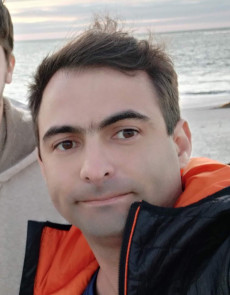

---
hide:
  - navigation
---

# **Humberto Sandmann**

{ style='border-radius: 10px;', align=left }

!!! custom inline end "Contact"

    [:material-email-outline:](mailto:hsandmann@ieee.org){:target='_blank'} [hsandmann@ieee.org](mailto:hsandmann@ieee.org){:target='_blank'}

    [:material-link:](https://hsandmann.github.io/){:target='_blank'} [hsandmann.github.io](https://hsandmann.github.io/){:target='_blank'} 
    [:material-github:](https://github.com/hsandmann){:target='_blank'} [hsandmann](https://github.com/hsandmann){:target='_blank'} 
    [:material-linkedin:](https://www.linkedin.com/in/hsandmann/){:target='_blank'} [hsandmann](https://www.linkedin.com/in/hsandmann/){:target='_blank'} 
    [:simple-orcid:](https://orcid.org/0000-0001-7758-695X){:target='_blank'} [0000-0001-7758-695X](https://orcid.org/0000-0001-7758-695X){:target='_blank'} 
    <!-- [:simple-odysee:](https://odysee.com/@sandmann){:target='_blank'} [sandmann](https://odysee.com/@sandmann){:target='_blank'} -->

Computer scientist specializing in bio-inspired neural computing, computational complexity and dynamics, pattern recognition, small-world theory, and banking knowledge. With a focus on understanding the foundations of human computation, I investigate biological neuronal approaches to replicate processing behaviors in computational intelligence.

In the realm of programming, I bring a strong background in highly complex domains, including modeling, software architecture, artificial intelligence, machine learning, deep learning, computer vision, cryptography, and high-performance computing, among others.

## Research Interests

Computational for large-scale systems 
Machine learning and artificial neural networks 
Nonlinear systems and dynamics networks 
Synchronization of coupled oscillators

## Background

<table>
    <tr>
        <td align='center'>
            <a href='./assets/doc/usp-doutorado-diploma.pdf' target='_blank'>mar/2012</a> 
            <a href='./assets/doc/usp-doutorado-grade.pdf' target='_blank'>&#8593;</a> 
            mar/2007
        </td>
        <td>
            D.Sc.<a href='http://ppgee.poli.usp.br/' target='_blank'>Polytechnic School of the University of Sao Paulo</a> 
            thesis<a href='https://doi.org/10.11606/T.3.2012.tde-05092012-165022' target='_blank'>Spike patterns and computation in dynamical neural networks</a> 
            doi<a href='https://doi.org/10.11606/T.3.2012.tde-05092012-165022' target='_blank'>10.11606/T.3.2012.tde-05092012-165022</a> 
            advisor<a href='https://www.lsi.usp.br/~emilio/index.htm' target='_blank'>Prof. Dr. Emilio Del Moral Hernandez</a> 
            presentation<a href='https://docs.google.com/presentation/d/e/2PACX-1vRz_rBkIJvEPpmL-LFe5bpTcQPEJ7uV1MKlU6L8_seherHmeSdKJ62v9IImdRrqPjX3El32ypNaFToz/pub?start=false&loop=false&delayms=3000' target='_blank'>slides</a> 
            supported by
            <ul class='support-list'>
                <li class='support-item'>
                    <a href='http://www.cnpq.br/' target='_blank'>CNPq</a> - grant 140632/2007-7 
                    <small>mar/2007 → dec/2009 ∧ sep/2010 → feb/2011</small>
                </li>
            </ul>
        </td>
        <td></td>
    </tr>
    <tr>
        <td align='center'>
            <a href='./assets/doc/mpi-report-marc_timme.pdf' target='_blank'>sep/2010</a> 
            &#8593; 
            <a href='./assets/doc/mpi-acceptance.pdf' target='_blank'>aug/2009</a>
        </td>
        <td>
            D.Sc. Internship<a href='https://www.ds.mpg.de/' target='_blank'>Max Planck Gesellschaft für Dynamik und Selbstorganisation</a> 
            advisor<a href='https://www.ds.mpg.de/person/20494/3509782' target='_blank'>Prof. Dr. Marc Timme</a> 
            supported by
            <ul class='support-list'>
                <li class='support-item'>
                    <a href='http://www.capes.gov.br/' target='_blank'>CAPES</a> - grant <a href='./assets/doc/capes-bex_4076-09-5.pdf' target='_blank'>BEX 4076-09-5</a> 
                    <small>jan/2010 → ago/2010</small>
                </li>
                <li class='support-item'>
                    <a href='http://www.usp.br/prpg/' target='_blank'>Pró-Reitoria da Pós-Graduação da USP</a> 
                    <small>aug/2009 ∧ dec/2009 (flight tickets GRU ⇄ FRA)</small>
                </li>
                <li class='support-item'>
                    José Humberto Sandmann - my father 
                    <small>aug/2009 → dec/2009 (German language classes/exams)</small>
                </li>
                <li class='support-item'>
                    <a href='http://www.mpg.de/' target='_blank'>Max Planck Institute - Networks Dynamics Group</a> 
                    <small>aug/2009 → nov/2009 (accommodation in Goettingen)</small>
                </li>
            </ul>
        </td>
        <td></td>
    </tr>
    <tr>
        <td align='center'>
            <a href='./assets/doc/usp-mestrado-diploma.pdf' target='_blank'>jun/2006</a> 
            <a href='./assets/doc/usp-mestrado-grade.pdf' target='_blank'>&#8593;</a> 
            feb/2003
        </td>
        <td>
            M.Sc.M.Sc.<a href='http://ppgee.poli.usp.br/' target='_blank'>Polytechnic School of the University of Sao Paulo</a> 
            dissertation<a href='https://doi.org/10.11606/D.3.2006.tde-01042009-095125' target='_blank'>Prediction of time series using architecture based on neuro-fuzzy systems</a> 
            doi<a href='https://doi.org/10.11606/D.3.2006.tde-01042009-095125' target='_blank'>10.11606/D.3.2006.tde-01042009-095125</a> 
            advisor<a href='https://www2.pcs.usp.br/~mtulio/' target='_blank'>Prof. Dr. Marco Túlio Carvalho de Andrade</a> 
        </td>
        <td></td>
    </tr>
    <tr>
        <td align='center'>
            <a href='./assets/doc/fei-graduacao-diploma.pdf' target='_blank'>dec/2002</a> 
            <a href='./assets/doc/fei-graduacao-grade.pdf' target='_blank'>&#8593;</a> 
            feb/1999
        </td>
        <td>
            B.Sc. at <a href='http://www.fei.edu.br/' target='_blank'>Faculdade de Engenharia Industrial</a> 
            Computer Science Bachelor 
        </td>
        <td></td>
    </tr>
    <tr>
        <td align='center'>
            <a href='./assets/doc/ete-grade.pdf' target='_blank'>dec/1998</a> 
            &#8593; 
            feb/1996
        </td>
        <td>
            <a href='https://www.jorgestreet.com.br/' target='_blank'>Escola Técnica Jorge Street</a> 
            Technician in Industrial Computation 
        </td>
        <td></td>
    </tr>
</table>

<!--
## Projects

## Experiences

<table>
    <tr>
        <td align='center'>
            now 
            &#8593; 
            jun/2024
        </td>
        <td>
            Contractor at <a href='http://ppgee.poli.usp.br/' target='_blank'>Link Business School</a> 
        </td>
    </tr>
    <tr>
        <td align='center'>
            now 
            &#8593; 
            ago/2018
        </td>
        <td>
            Assistant Professor at <a href='http://ppgee.poli.usp.br/' target='_blank'>Insper</a> 
        </td>
    </tr>
    <tr>
        <td align='center'>
            now 
            &#8593; 
            ago/2014
        </td>
        <td>
            Assistant Professor at <a href='http://ppgee.poli.usp.br/' target='_blank'>ESPM</a> 
        </td>
    </tr>
</table>
Link

Insper

ESPM

H-Sandmann

## Lectures

  <table>
    <tr><td colspan="2">
      Insper Learning Institution
       <small><i>Undergraduate courses</i></small>
    </td></tr>  
    <tr>
      <td><small>Software Design</small></td>
      <td width="60"><small><small>2019 - now</small></small></td>
    </tr>
    <tr>
      <td><small>Foundations for Physical Communication</small></td>
      <td width="60"><small><small>2018</small></small></td>
    </tr>
  </table>

  <table>
    <tr><td colspan="2">
      ESPM
       <small><i>Undergraduate courses</i></small>
    </td></tr>  
    <tr>
      <td><small>Artificial Intelligence and Society</small></td>
      <td width="60"><small><small><a href="/espm.ai.society/" target="_blank">2019 - now</a></small></small></td>
    </tr>
    <tr>
      <td><small>Artificial Intelligence for Marketing</small></td>
      <td width="60"><small><small><a href="/espm.ml/" target="_blank">2019 - now</a></small></small></td>
    </tr>
    <tr>
      <td><small>Enterprise Environment: computer architectures and operating systems</small></td>
      <td width="60"><small><small><a href="/espm.tec.105/" target="_blank">2014 - now</a></small></small></td>
    </tr>
    <tr>
      <td><small>Data Structure and Algorithms - DSA</small></td>
      <td width="60"><small><small>2017</small></small></td>
    </tr>
  </table>

  <table>
    <tr><td colspan="2">
      IBTA
       <small><i>Undergraduate courses</i></small>
    </td></tr>  
    <tr>
      <td><small>Basics of Robotics</small></td>
      <td width="60"><small><small>2016</small></small></td>
    </tr>
    <tr>
      <td><small>Object-Oriented Programming</small></td>
      <td width="60"><small><small>2016</small></small></td>
    </tr>
    <tr>
      <td><small>Data Structures and Algorithms - DSA</small></td>
      <td width="60"><small><small>2016</small></small></td>
    </tr>
  </table>

  <table>
    <tr><td colspan="2">
      FIAP
       <small><i>MBA courses</i></small>
    </td></tr>  
    <tr>
      <td><small>NoSQL and Big Data: MongoDB, SparQL, Neo4j, Solr, Hive, Hadoop</small></td>
      <td width="60"><small><small>2014 - 2015</small></small></td>
    </tr>
    <tr><td colspan="2">
      <small><i>Undergraduate courses</i></small>
    </td></tr>  
    <tr>
      <td><small>Distributed Systems</small></td>
      <td width="60"><small><small>2015</small></small></td>
    </tr>
    <tr>
      <td><small>Data Structures and Techniques for Algorithms II - DSA</small></td>
      <td width="60"><small><small>2013</small></small></td>
    </tr>
    <tr>
      <td><small>Algorithms</small></td>
      <td width="60"><small><small>2012 - 2013</small></small></td>
    </tr>
    <tr>
      <td><small>Advanced Programming Techniques for Java</small></td>
      <td width="60"><small><small>2012</small></small></td>
    </tr>
    <tr>
      <td><small>Database I - Oracle</small></td>
      <td width="60"><small><small>2012 - 2013</small></small></td>
    </tr>
    <tr>
      <td><small>Database II - Oracle</small></td>
      <td width="60"><small><small>2012 - 2013</small></small></td>
    </tr>
  </table>
  
  <table>
    <tr><td colspan="2">
      Toledo Prudente
       <small><i>Graduate courses</i></small>
    </td></tr>  
    <tr>
      <td><small>MBA course on big data and machine learning</small></td>
      <td width="60"><small><small>2015</small></small></td>
    </tr>
  </table>

  <table>
    <tr><td colspan="2">
      Universidade Cruzeiro do Sul
       <small><i>Undergraduate courses</i></small>
    </td></tr>  
    <tr>
      <td><small>Programming for Mobile - Android</small></td>
      <td width="60"><small><small>2012</small></small></td>
    </tr>
    <tr>
      <td><small>Computer Architectures</small></td>
      <td width="60"><small><small>2012</small></small></td>
    </tr>
    <tr>
      <td><small>Software Engineering</small></td>
      <td width="60"><small><small>2012</small></small></td>
    </tr>
    <tr>
      <td><small>Database II - Oracle</small></td>
      <td width="60"><small><small>2012 - 2013</small></small></td>
    </tr>
    <tr>
      <td><small>Languages and Techniques for Programming</small></td>
      <td width="60"><small><small>2012</small></small></td>
    </tr>
  </table>

  <table>
    <tr><td colspan="2">
      Universidade Nove de Julho
       <small><i>Undergraduate courses</i></small>
    </td></tr>  
    <tr>
      <td><small>Algorithms for Engineering</small></td>
      <td width="60"><small><small>2011</small></small></td>
    </tr>
    <tr>
      <td><small>Computer Architectures</small></td>
      <td width="60"><small><small>2011</small></small></td>
    </tr>
    <tr>
      <td><small>Programming for Internet</small></td>
      <td width="60"><small><small>2011</small></small></td>
    </tr>
  </table>

## Teaching assistant

  <table>
    <tr><td colspan="3">
      Polytechnic School of the University of Sao Paulo
       <small>Undergraduate courses</small>
    </td></tr>  
    <tr>
      <td><small><a href="https://uspdigital.usp.br/jupiterweb/obterDisciplina?sgldis=PSI2672" target="_blank">PSI&nbsp;2672</a></small></td>
      <td><small>Experimental Pattern Recognition, Modeling and Neurocomputing</small></td>
      <td width="60"><small><small>2011*</small></small></td>
    </tr>
    <tr>
      <td><small><a href="https://uspdigital.usp.br/jupiterweb/obterDisciplina?sgldis=PSI2533" target="_blank">PSI&nbsp;2533</a></small></td>
      <td><small>Modeling for Signal Processing: Neural Networks and Learning</small></td>
      <td width="60"><small><small>2009, 2008*</small></small></td>
    </tr>
    <tr>
      <td><small><a href="https://uspdigital.usp.br/jupiterweb/obterDisciplina?sgldis=PCS2302" target="_blank">PCS&nbsp;2302</a></small></td>
      <td><small>Laboratory of the Foundations of Computing Engineering</small></td>
      <td width="60"><small><small>2008†</small></small></td>
    </tr>
  </table>
  <small><small>\* grants from CAPES (PAE)</small></small> 
  <small><small>† grants from FAPESP</small></small>

<!-- ## Languages

**Portuguese** - native 
**English** - advanced 
**German** - B1 -->

## Publications

E.Del-Moral-Hernandez; H. Sandmann; G.Araujo; **Context dependent pattern recognition - A framework for hybrid architectures bridging chaotic neural networks based on Recursive Processing Elements and symbolic information**.
IEEE Transactions on Neural Networks, 2009.
doi: <a href='https://doi.org/10.1109/IJCNN.2009.5179061' target='_blank'>10.1109/IJCNN.2009.5179061</a>.

L.A. da Silva; H. Sandmann; E.Del-Moral-Hernandez; **A self-organizing architecture of recursive elements for continuous learning**.
IEEE Transactions on Neural Networks, 2008.
doi: <a href='https://doi.org/10.1109/IJCNN.2008.4634190' target='_blank'>10.1109/IJCNN.2008.4634190</a>.

E.Del-Moral-Hernandez; H. Sandmann; L.A. da Silva; **Pattern recovery in networks of recursive processing elements with continuous learning**.
IEEE Transactions on Neural Networks, 2004.
doi: <a href='https://doi.org/10.1109/IJCNN.2004.1379877' target='_blank'>10.1109/IJCNN.2004.1379877</a>.

<!--

## Activities in societies

-   :material-clock-fast:{ .lg .middle } [__Computational Intelligence Society__](http://www.ieee-cis.org/){:target='_blank'}

    ---
    - since 2004
    - member of the brazilian committee
        - <small>oct/2010 - mar/2012</small>
        - <small>apr/2009 - aug/2009</small>

-   :fontawesome-brands-markdown:{ .lg .middle } __It's just Markdown__
    ---

    Focus on your content and generate a responsive and searchable static site

    [:octicons-arrow-right-24: Reference](#)

-   :material-format-font:{ .lg .middle } __Made to measure__

    ---

    Change the colors, fonts, language, icons, logo and more with a few lines

    [:octicons-arrow-right-24: Customization](#)

-   :material-scale-balance:{ .lg .middle } __Open Source, MIT__

    ---

    Material for MkDocs is licensed under MIT and available on [GitHub]

    [:octicons-arrow-right-24: License](#)

- **[IEEE](http://www.ieee.org/) - Institute of Electrical and Electronics Engineers**
   <small>Member #60216475</small>

  - **Computational Intelligence Society** ([CIS](http://www.ieee-cis.org/))
    - since 2004
    - member of the brazilian committee
      - <small>from oct/2010 to mar/2012</small>
      - <small>from apr/2009 to aug/2009</small>

  - **Signal Processing Society** ([SPS](http://www.signalprocessingsociety.org/))
    - from 2005 to 2009

  - **Engineering in Medicine and Biology Society** ([EMBS](http://www.embs.org/))
    - from 2005 to 2009

- **[INNS](http://www.inns.org/) - International Neural Network Society**
   <small>Student member #3951</small>

## Interesting

- [Nicolau Werneck](http://nwerneck.sdf.org/){:target='_blank'}
- [Mirko Lukovic](https://ifb.ethz.ch/comphys/people/senior-scientists/mirko-lukovic.html){:target='_blank'}
- [Erik Martens](http://eam.webhop.net/){:target='_blank'}
- [Christian Bick](https://www.math.vu.nl/~bick/){:target='_blank'}
- [Tatjana Tchumatchenko](http://www.tchumatchenko.de/){:target='_blank'}
- [Sven Boekhoff](http://www.boekhoff.info/){:target='_blank'}

- [Dynamics Days](http://dynamicsdays.info/){:target='_blank'}
- [IJCNN - International Joint Conference on Neural Networks](http://www.ijcnn.org/){:target='_blank'}
- [NIPS - Neural Information Processing Systems](http://nips.cc/){:target='_blank'}

 

 

 

 
<!--  

x
){:target='_blank'}

{:target='_blank'}

-->